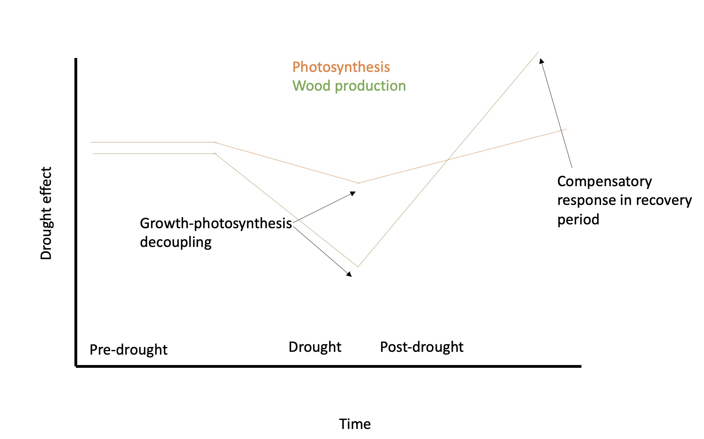

```{r setup, include=FALSE}
knitr::opts_chunk$set(echo = TRUE)
```


\raggedright

**Title:** (Understanding the decoupling of CO~2~ uptake and woody production) *(many commentaries have clever, catchy, somewhat informal titles)*

**Authors:** 

Kristina J. Anderson-Teixeira^1,2^* (Orcid ID : 0000-0001-8461-9713)

Steven A. Kannenberg^3^ (ORCID: 0000-0002-4097-9140)


**Author Affiliations:**

1. Conservation Ecology Center; Smithsonian National Zoo & Conservation Biology Institute; Front Royal, Virginia 22630, USA

2. Forest Global Earth Observatory; Smithsonian Tropical Research Institute; Panama, Republic of Panama

3. Department of Biology, Colorado State University, Fort Collins, Colorado 80523, USA


*corresponding author: teixeirak@si.edu; +1 540 635 6546


**keywords:** *(5-8)* <!--5-8 keywords. Should be given after references, but .Rmd can't do that.-->

**quote:** *(A brief quote extracted from the Commentary should be included after the article title.)*


| | count |
|--|--|
|words|  *(1500 max)* | <!--1200– 1500 words (~6-10 par) -->
|figures|  *(1-2 encouraged)* | <!--encouraged to use one or two figures (or tables/ boxes) in addition to help the explanation or simply to illustrate the general area-->
|tables| 0 |
|references | *(15 max)* | <!--max 15-->


\newpage
<!--The highlighted article should be cited in the first paragraph in the style ‘In this issue of New Phytologist, Smith et al. (pp. 000-000) ...’.-->
As the climate changes and scientists seek to project its future course, an important uncertainty lies in the response of forests. 
Will rising atmospheric carbon dioxide (CO~2~) and lengthening growing seasons relieve limitations to tree growth, allowing increased carbon (C) sequestration in long-lived woody tissues and providing a negative feedback to climate change?
Or will increasing heat and drought stress reduce growth and increase mortality, resulting in a positive feedback to climate change?
To answer this question, global C cycle models simulate photosynthesis under future conditions, using simple plant C allocation schemes to determine the amount of C sequestered in woody growth versus that allocated to short-lived pools that are more rapidly respired back to the atmosphere as CO~2~ [@fatichi_moving_2014]. 
Yet, there is growing evidence that these schemes are too simplistic, as wood production is frequently decoupled from photosynthesis [@delpierre_wood_2016; @etzold_number_2022], either through passive limitation of woody tree growth by environmental conditions or active allocation away from woody growth to support other sinks.
Needed, then, is an understanding of how woody growth is jointly shaped by photosynthesis (i.e., source limitation) and demand from various C sinks (i.e., sink limitation) across species and biomes [@korner_paradigm_2015]. 
In this issue of *New Phytologist*, Martinez-Sancho *et al.* (pp. 000-000) exemplifies the type of research needed to improve our ability to predict forest C sequestration under climate change, using an innovative approach to describe the seasonal course of C sequestration in tree stem growth and how it is affected by drought.

Characterizing the seasonal course of woody growth is challenging, even with frequent dendrometer measurements, because stems shrink and swell in relation to their hydraulic status, and because C sequestration associated with cell wall thickening lags behind radial growth [@cuny_woody_2015; @martinez-sancho_drought_2022].
To understand the timing of C sequestration, @martinez-sancho_drought_2022 collected weekly microcores to characterize the seasonal timing of wood formation, and then combined this information with a detailed analysis of wood anatomy and C stable isotopes (∂^13^C). <!--following methods pioneered by @cuny_generalized_2013, @perez-de-lis_cutting_2022, @cuny_woody_2015--> 
In a non-drought year (2014), the rate of cell expansion peaked at the end of June, while rates of cell wall thickening and C sequestration peaked in early July, with all three variables displaying a unimodal peak. 

<!--drought impacts-->
Extreme summer drought in 2015 resulted in dramatically different seasonal patterns of woody growth and C sequestration (**Fig. 1**). 
During a 41-day period from mid-June to late July during which stem radial shrinkage indicated physiological water stress, rates of cell enlargement and thickening were slowed, resulting in bimodal growth and C sequestration curves with peaks before and after the drought. 
Overall, C sequestration was reduced 67% during the drought period.
Meanwhile, ∂^13^C isotopes indicated increased C isotope discrimination, indicative of water limitation resulting in higher intrinsic water use efficiency during the drought. 
The ∂^13^C drought signature appeared in wood formed after the drought, indicating that while sink limitations prevented the C fixed during the drought from contributing immediately to woody growth, this C was reserved and used to accelerate growth after the drought. 
Indeed, higher compensatory growth and C sequestration rates after the drought resulted in similar total C sequestration during the drought and reference years [@martinez-sancho_drought_2022].
Thus, study of intraannual dynamics of wood formation revealed a drought impact on growth that would have gone undetected at the annual scale.




The findings of @martinez-sancho_drought_2022 point to the importance of the timing of drought.
*(some content on how drought timing affects annual growth -- e.g., @dorangeville_drought_2018)*

The @martinez-sancho_drought_2022 study adds to growing evidence that CO~2~ uptake and woody production are decoupled. 
...[@cabon_crossbiome_2022] 
….*GPP* is less sensitive to drought than *ANPP~woody~* [@kannenberg_droughtinduced_2022].
...[@dow_warm_inpress]
...[@jiang_fate_2020]
Of course, these observations of decoupling do not imply that *ANPP~woody~* is completely decoupled from *GPP*; rather, the two show some level of correlation both in relation to interannual climatic variation at a single site [@cabon_crossbiome_2022] and across broad climatic gradients [@banburymorgan_global_2021]. 
However, we now have clear evidence that it is not realistic to expect that a constant allocation of photosynthate will be allocated to woody growth on either intraanuual or interannual time scales.
This fact has implications for our understanding of the relationship of annual tree growth to climate -- both in the past and in the future. 

*(Paragraph on implications for tree-ring studies:)*
The annual growth records recorded in tree rings are routinely used to understand the climate sensitivity of tree growth and thereby to reconstruct past climates[@fritts_tree_1976] or understand how forest productivity may respond to future climate change [e.g., @cabon_crossbiome_2022; @kannenberg_droughtinduced_2022; @dow_warm_inpress].
Moreover, as shown by @martinez-sancho_drought_2022, a severe drought might not even register in annual tree-rings if it is short enough that C fixed during the drought [by the less moisture-sensitive process of photosynthesis; @delpierre_wood_2016_verify; @kannenberg_droughtinduced_2022] can bolster late-season wood formation and compensate for missed growth during the drought.
The implication is that the ability of annual growth rings to capture drought depends on the timing and nature of the drought. 
*(other implications for tree-ring studies?)*

*(one paragraph discussing models:)*
The decoupling of *ANPP~woody~* from *GPP* also has important implications for global C cycle models. 
Most models represent C allocation to *ANPP~woody~* as a constant fraction of *GPP* [@ref], and thereby effectively assume that long-term C sequestration in woody growth -- the main variable of interest for climate change projections -- parallels *GPP*. 
Yet, as reviewed above, this assumption is not accurate and represents an important uncertainty in these models.
(Models may project over- or under-predict drought sensitivity, depending on the timing and nature of the drought.)
To get models right, we need to understand seasonal patterns of C allocation to woody growth and how they are influenced by climate variation (and change)

We need more studies like @martinez-sancho_drought_2022 -- bonus if they also get GPP -- to broaden our understanding of how *ANPP~woody~* is jointly shaped by climate-- both directly and indirectly (through GPP).

*(active vs passive allocation)*

# Misc text to incorporate
This decoupling arises due to either a) passive limitation of woody tree growth by environmental conditions (as cellular division and enlargement ceases sooner than photosynthesis during periods of temperature or water stress), or b) active allocation away from woody growth to support other sinks (e.g., non-woody tissues, reproduction, respiration, root exudation, non-structural carbohydrate pools). 

Despite growing evidence that C uptake and woody growth are frequently decoupled, we lack a comprehensive understanding regarding: 1) when, where, and why this decoupling occurs, 2) the spatial and temporal scales at which it operates, and 3) the implications for how we understand and model the forest C cycle. Given the complexity of tree physiology and forest C cycling, answering these open questions necessitates cross-scale and cross-methodology approaches. 


\newpage

# References {-#References}
<!--The highlighted article should be included in the References section (the page numbers should be listed as 000–000).-->


